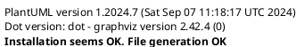

# 准备

插件：

​		PlantUML4idea.zip 

​		来源网站：https://plugins.jetbrains.com/plugin/7017-plantuml-integration/versions

图形编辑：

​		graphviz-2.38.msi(2.38为win10下稳定版)

​		来源网站：https://graphviz.gitlab.io/download/

# 嵌入Rider

1. 将graphviz-2.38.msi解压到指定文件夹，系统属性 **环境变量 Path**添加：

```
E:\graphviz\bin #换成解压后指定文件夹(此处是我自己的绝对路径)
```

2. 打开Rider，File->Setting->Plugins

   将PlantUML4idea.zip从Disk中添加进来

3. 重启Rider

# 测试

Rider中新建puml文件，输入：



结果显示：

```
Installation seems OK. File generation OK #成功
```


